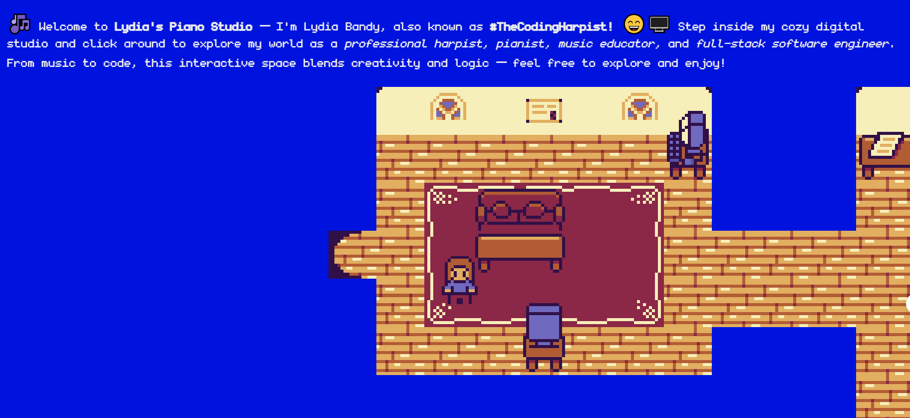

# 🎮 Lydia Bandy - 2D Developer Portfolio

This project is my developer portfolio presented in a 2D game format!  
Built using **Kaboom.js**, **JavaScript**, **Vite**, and **Node.js**.  
Text elements are rendered with **HTML/CSS** (not Canvas).  
Hosted via **GitHub Pages** using **Vite**.



---

## 🚀 Technologies Used

- [Kaboom.js](https://kaboomjs.com/) - Game development library
- [Vite](https://vitejs.dev/) - Frontend build tool
- [Node.js](https://nodejs.org/) - Runtime environment
- [HTML](https://developer.mozilla.org/en-US/docs/Web/HTML) / [CSS](https://developer.mozilla.org/en-US/docs/Web/CSS) - Text rendering and styling
- [GitHub Pages](https://pages.github.com/) - Hosting platform

---

## 📬 Contact & Connect

- 🌐 Website: [lydiaspianostudio.com/contact](https://lydiaspianostudio.com/contact/)
- 💼 LinkedIn: [Lydia Bandy on LinkedIn](https://www.linkedin.com/in/lydia-bandy/)
- 📧 Email: [Contact Form](https://lydiaspianostudio.com/contact/)

---

## 🙌 Credits

- **Tutorial Inspiration:** Thanks to [@JSlegenddev](https://www.youtube.com/@JSlegenddev) for the awesome Kaboom.js portfolio tutorial and template: [Watch it here](https://www.youtube.com/watch?v=gwtfWORCN0U)
- **Tileset Art:** [Happy La v2 Tileset](https://momen-games.itch.io/happy-la-v2-ts) by Momen Games

---

## 📄 How to Run Locally

1. Clone the repository
2. Install dependencies

   ```bash
   npm install
   ```

3. Start the development server

   ```bash
   npm run dev
   ```

4. Open your browser at `http://localhost:5173`

---

## 🛠️ Features

- 2D tilemap navigation
- Animated player movement
- Interactive text and links
- HTML/CSS UI elements over a canvas-based game

---

## 📜 License

This project is free for personal use.  
Attribution to original tutorial and tileset creator is included.

---
